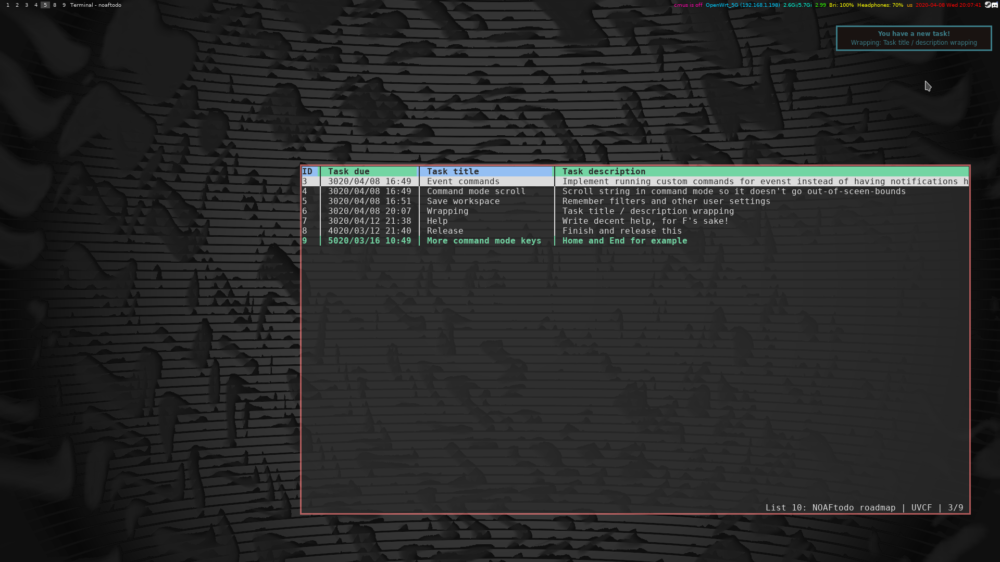

# NOAFtodo
A TODO-manager No One Asked For. Written in C++, with ncurses, notification support, love and absolutely no clue why.

### Features
* minimalisic interface written with ncurses
* primitive TODO list management: add and remove tasks with dues, marking tasks as completed, filtering failed, completed, upcomig and uncategorized tasks.
* a daemon that works and background, tracks tasks dues and completion and sends notifications via libnotify

### Default shortcuts:
* ? - :?
* q or \<esc\> - :q
* up arrow or k - :up
* down arrow or j - :down
* a - :a a (no autoexec)
* A - :a (no autoexec)
* \<space\> - :c
* d - :d (no autoexec)
* gg - :g 0
* [input number]g - :g [input number]
* Gg - :g [last item index]
* U - :vtoggle uncat
* F - :vtoggle failed
* C - :vtoggle coming
* V - :vtoggle complete

Not really much more to say. _Yet?_
