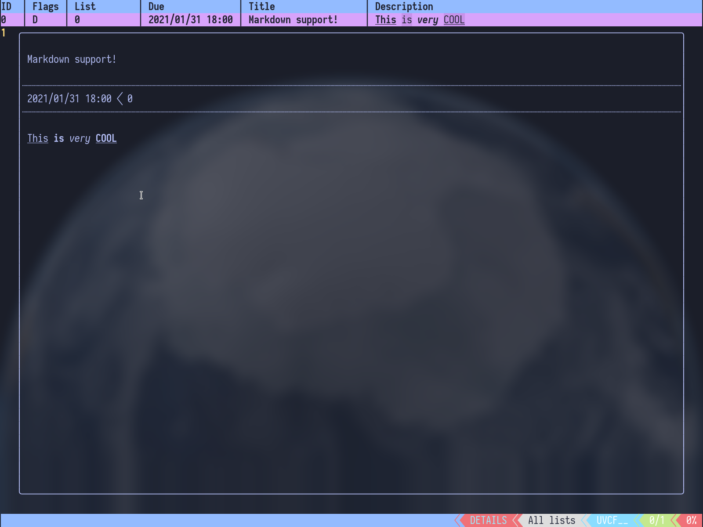
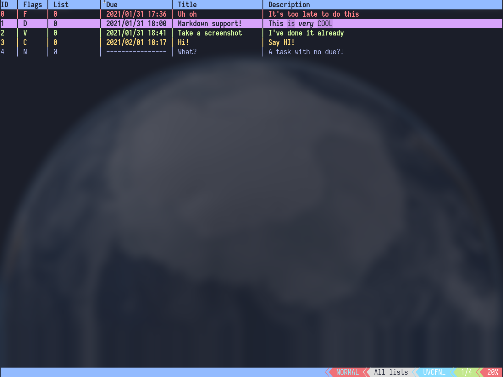

# NOAFtodo

A TODO-manager No One Asked For. Written in C++, with ncurses, love and absolutely no clue why.

[Take me to the screenshots!](#screenshots)


[](https://www.codefactor.io/repository/github/gregthemadmonk/noaftodo)

[](https://aur.archlinux.org/packages/noaftodo-git/)[](https://aur.archlinux.org/packages/noaftodo-git/)

### Hey you! Yes, <ins>YOU</ins>! There is an unfinished [guide](https://github.com/GregTheMadMonk/noaftodo/wiki/Guide) on the NOAFtodo Wiki!
Come take a look, or help finish it by becoming a wiki contributor or telling what information you and others will find most useful!

### Features

### See [NOAFtodo roadmap](https://github.com/GregTheMadMonk/noaftodo/projects/1) to take a look on planned features and how much is ready from the next release.

- [x] minimalisic interface written with ncurses with different display modes
- [x] multiple lists between which tasks can be moved
- [x] TODO list management: add and remove tasks with or without dues and of different duration, mark tasks as completed, basic task editing
- [x] task filtering: by flag (failed, upcoming, completed, nodue, uncategoorized), by list (tag), regex serach titles and descriptions
- [x] a daemon that can work in background, track tasks dues and completion and is able to execute custom commands on certain events (like sending notifications)
- [x] per-task events on top of global events, which allow you to do some tricky things (creaing recurring tasks or setting up something like an alarm clock)
- [x] bugs *WHO WROTE THAT?!!*

### Issues

If you have any problems with the program, please open an issue here.
It's much faster than waiting for me to notice a mistake, and I try to fix things as soon as possible.

### Using NOAFtodo

Getting started is pretty well covered in coreesponding [guide](https://github.com/GregTheMadMonk/noaftodo/wiki/Guide) section.

Default list is created as **$HOME/.noaftodo-list** and delault config is copied to **$XDG_CONFIG_HOME/noaftodo.conf** or **$HOME/.config/noaftodo.conf**, if **$XDG_CONFIG_HOME** is not defined.

Also running without creating a config is supported with `noaftodo -c default`, as default config is included in the program during compilation.

### Installing
#### AUR
Program is available in **AUR** as **noaftodo-git**.

### Building [[more](https://github.com/GregTheMadMonk/noaftodo/wiki/Guide#building)]
NOAFtodo is compiled using **cmake**:
```shell
$ cd path/to/noaftodo/repo
$ mkdir build && cd build
$ cmake .. && make   # replace "make" with "gmake" on Solaris 11 and maybe some other systems
```

#### Dependencies
* **ncurses** (on an Arch-based system: `sudo pacman -S ncurses`, on a Debian-based system: `sudo apt install libncurses5-dev`)
* (optional) **notify-send** (provided by `libnotify` and `libnotify-bin` on Arch and Debian based distributions respectively) and a notification deamon of your choise
* **sed** and **grep**, but come on, everyone has these

### Configuring
See [noaftodo.conf.template](https://github.com/GregTheMadMonk/noaftodo/blob/master/noaftodo.conf.template) if you want an example configuration.

### Screenshots

</img>
</img>
</img>
